# Weighted HiPro Case

This 3d printed Weighted HiPro Case is designed for MX or Kailh Choc switches. This case is designed
with a snap fit assembly, and to include 200g weight in each half.

You can print your own case using the files below or buy one from me! The cases are printed on demand
and can be made in a color of your choice, it is even possible to try and match the color to your keycaps.
Prices start from €60 plus shipping from Europe. If your interested please contact me at
richard.titmuss@gmail.com or on [Discord](https://discordapp.com/users/745293992044003348/) for more
information.

**MX Case**

**Choc Case**

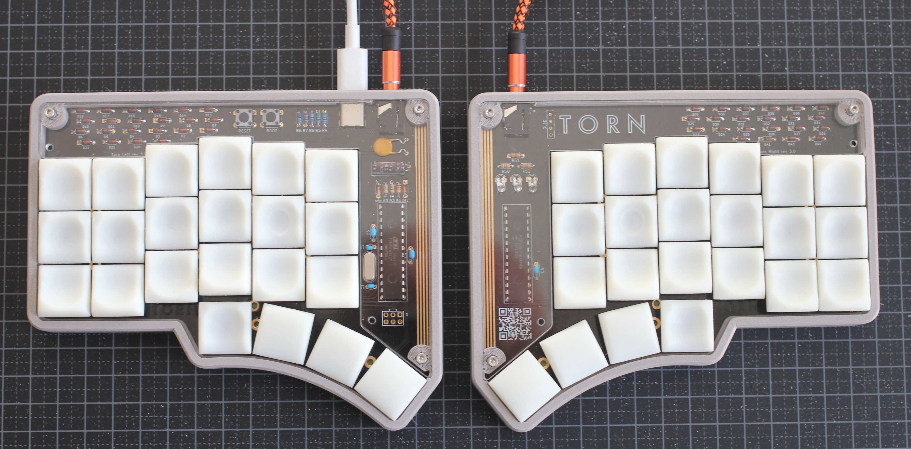

## Parts

To complete the Weighted HiPro Case you need:

- Assembled Torn PCBs with MX or Kailh Choc switches
- 3d printed parts using the STLs below
- 2 x Torn acrylic covers
- 6 x m2 nuts
- 6 x m2 x 20mm cheese head screws (MX switches)
- 6 x m2 x 16mm cheese head screws (Choc switches)
- Car wheel balance weights. 10g: 23mm x 19mm. 5g: 12mm x 19mm. height 4mm (including adhesive padding).
For example:
[US](https://www.amazon.com/Pit-Posse-Balancing-Weights-Adhesive/dp/B00OQWS98S/ref=sr_1_13?dchild=1&keywords=balancing+weight&qid=1620718949&sr=8-13),
[UK](https://www.amazon.co.uk/FIERCE-CYCLE-Balance-Weights-Motorcycle/dp/B07QQ539GV/ref=sr_1_7?crid=7JSFKDWAYNL7&dchild=1&keywords=balancing+weights&qid=1620718843&sprefix=balancing+wei%2Caps%2C164&sr=8-7),
[SE](https://www.amazon.se/gp/product/B01GHKG18G/ref=ppx_yo_dt_b_asin_image_o00_s00?ie=UTF8&psc=1).

## STLs

This case has been tested with a Prusa i3 Mk3S+ using PTEG. The parts are designed to be a tight fit
so tolerances may vary with other printers or plastics. The parts are available in STL or 3MF. You
can use the 3MF files in [PrusaSlicer](https://www.prusa3d.com/prusaslicer/) and they contain the
recommended print settings.

You need to 3d print the following parts:

### Base (MX and Choc switches)

- Left Base [STL](./stl/Left%20base.stl) [3MF](./stl/Left%20base.3mf)
- Right Base [STL](./stl/Right%20base.stl) [3MF](./stl/Right%20base.3mf)

Print Settings: **No supports. 15% infill. 135 degree bridging angle.**

The 3MF files include a color change for the Torn logo on the base. First load the color for the logo,
and then change to the case color after the letters have printed
([using this technique](https://forum.prusaprinters.org/forum/prusaslicer/manual-multicolor/)).
The STL files use bridging for a debossing effect.

### Top (MX switches)

- MX Left Top [STL](./stl/Left%20MX%20top.stl) [3MF](./stl/Left%20MX%20top.3mf)
- MX Right Top [STL](./stl/Right%20MX%20top.stl) [3MF](./stl/Right%20MX%20top.3mf)

This part prints upside down (the STL is oriented for printing). Supports are needed on the rim 
where the acrylic cover fits.

Print Settings: **Supports on build pate only. 15% infill.**

- MX Left Spacer [STL](./stl/Left%20MX%20Spacer.stl) [3MF](./stl/Left%20MX%20Spacer.3mf)
- MX Right Spacer [STL](./stl/Right%20MX%20Spacer.stl) [3MF](./stl/Right%20MX%20Spacer.3mf)

Print Settings: **No supports. 15% infill.**

### Top (Choc switches)

- Choc Left Top [STL](./stl/Left%20Choc%20top.stl) [3MF](./stl/Left%20Choc%20top.3mf)
- Choc Right Top [STL](./stl/Right%20Choc%20top.stl) [3MF](./stl/Right%20Choc%20top.3mf)

### Encoder Knob (optional)

You can use this encoder knob to color match with your case.

- EC11 Knob [STL](./stl/EC11%20Knob.stl)

Print Settings: **No supports. 15% infill.**

### License

The Torn Weighted HiPro Case is licensed under [Creative Commons Attribution-NonCommercial 4.0 International License](https://creativecommons.org/licenses/by-nc/4.0).

## Build guide

Before assembling the Weighted HiPro Case you need to have assembled the [Torn PCBs](../../doc/pcb.md).

**Choc Switches: Do not use the IC sockets (steps 13 and 22 in the main instructions). The ATMega328P and MCP23017 
must be directly soldered to the PCB. This is needed to reduce the height.**

Repeat steps 1-9 for the left and right sides of the keyboard.

### Step 1

Carefully remove *all* the support material from the case top. Test that the acrylic cover fits
flush with the edge of the case.

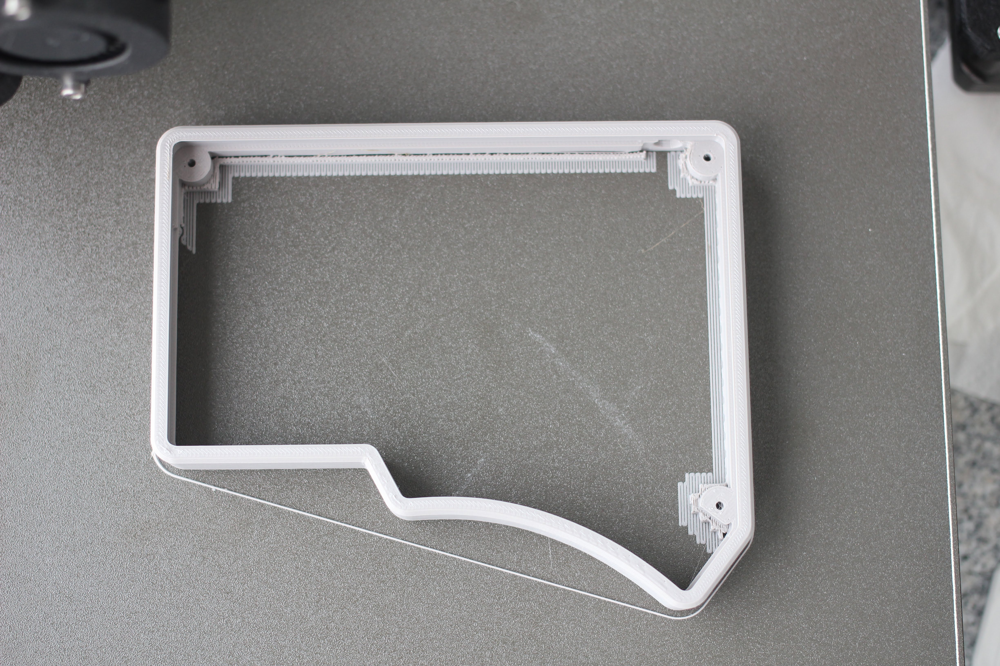

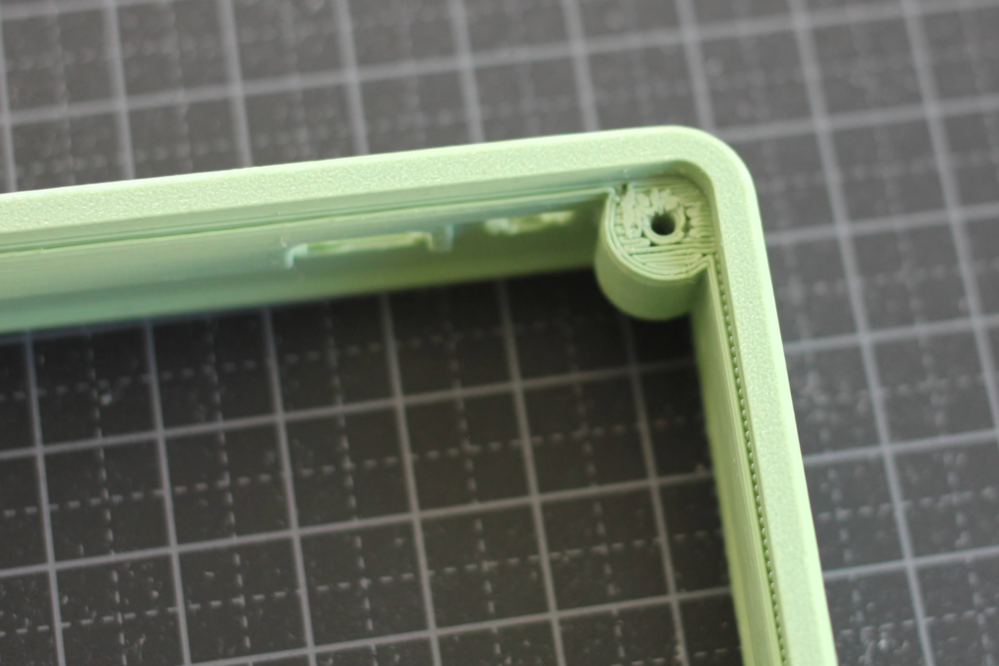

### Step 2

Insert three m2 nuts in the base of the case. Use a m2 screw to pull the nuts securely into the
base. Remove the screw afterwards. 

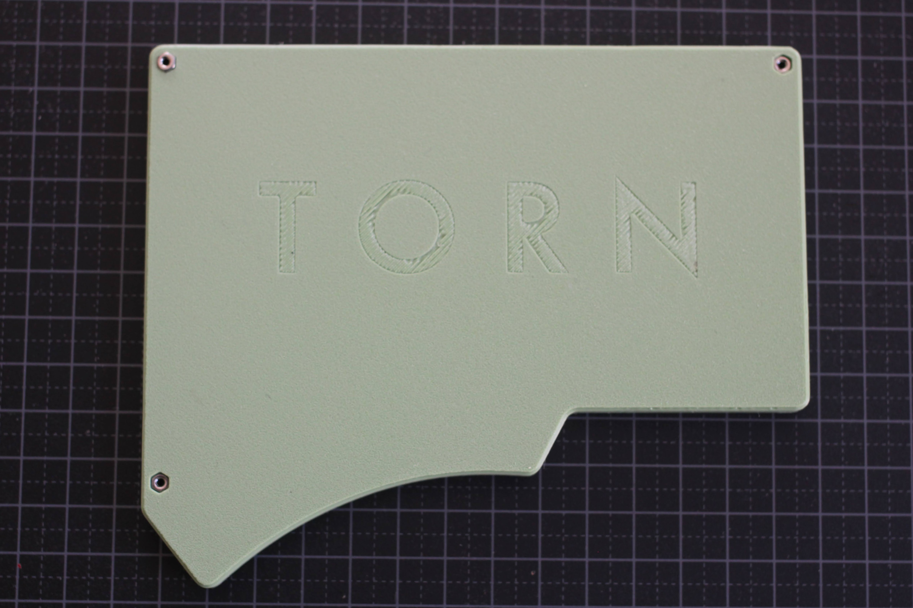

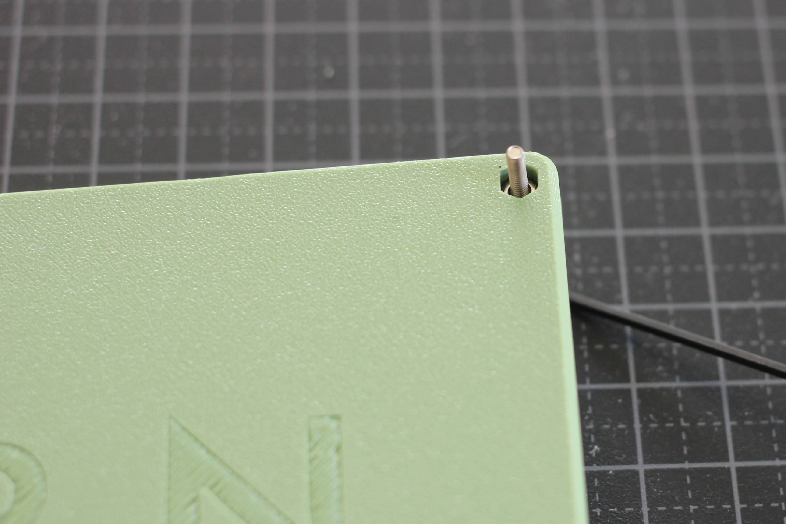

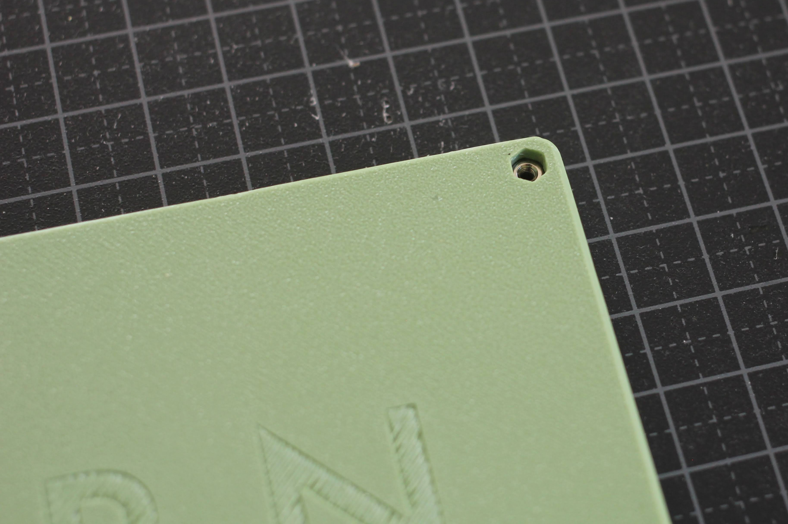

### Step 3

Cut the car wheel balance weights to fit the case. Secure then with the self-adhesive padding. Be
neat, there is not any spare room! 

### Step 4 (MX switches only)

Assemble the spacer and plate. 

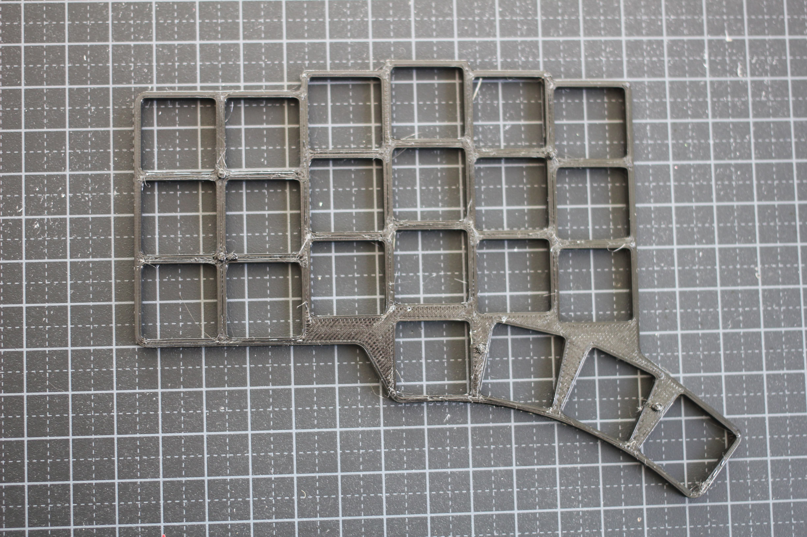

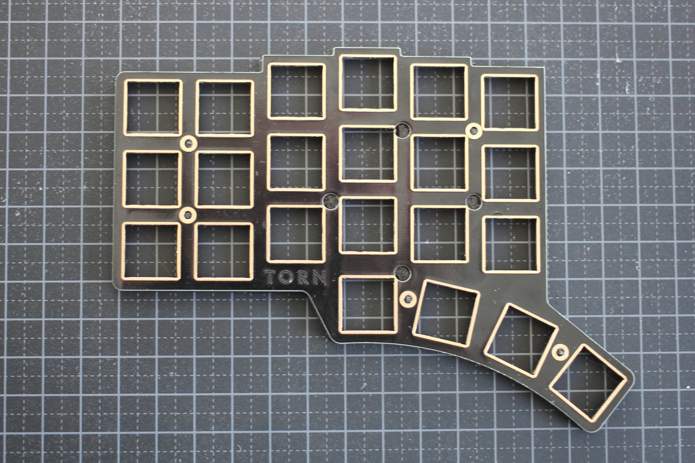

### Step 5

Insert a few switches in the plate, and assemble with the PCB. Make sure everything fits correctly,
and then add the remaining switches. Solder the switches (if you are not using Kailh MX sockets).

**Test that all the switches work before continuing.** You can take apart the case but this is not
easy with the snap fit assembly.

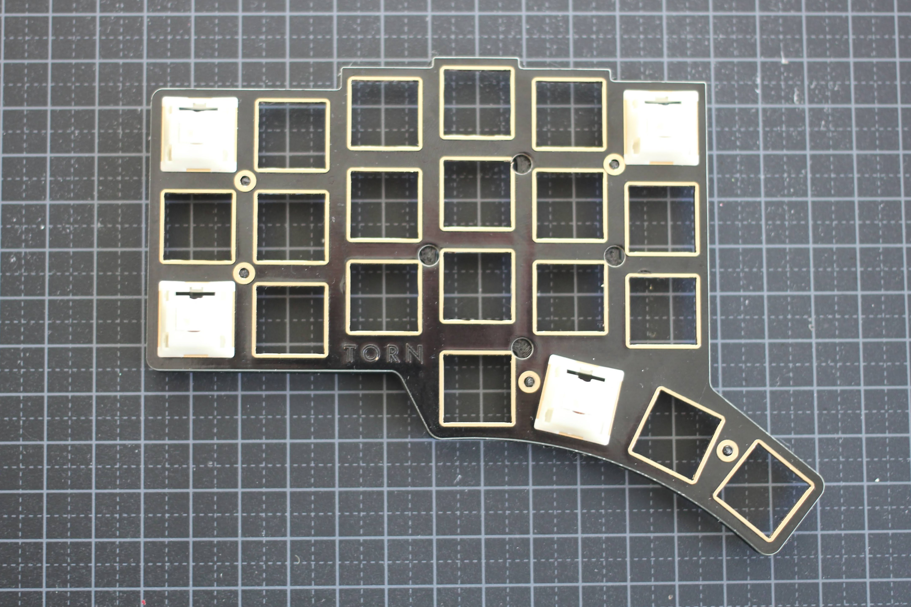

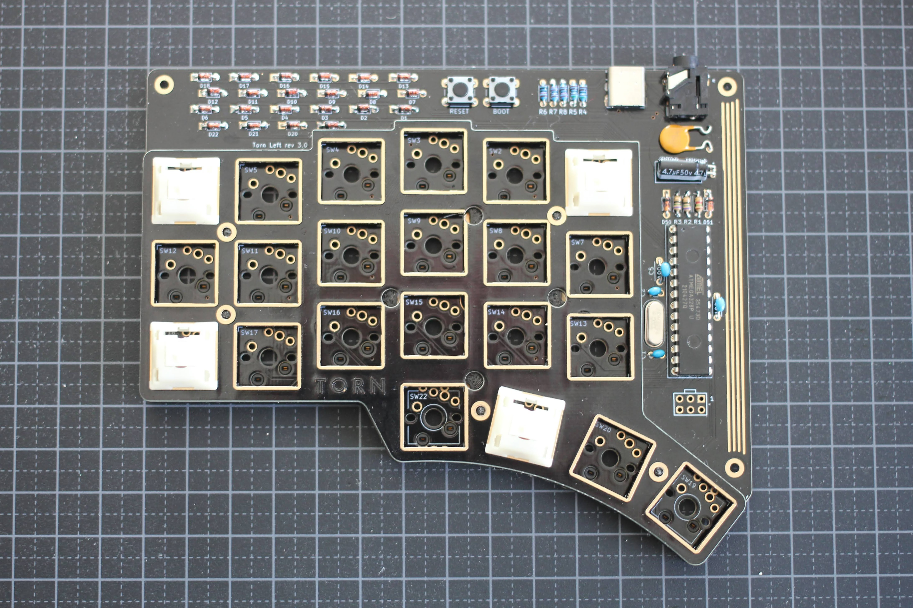

### Step 6

Insert the PCB into the top of the case. Start fitting the back edge as shown below. Make sure the
TRRS socket is in the correct place. Then carefully work around the edge of the case pressing the PCB
in place, ending by the thumb keys. You'll need to gently 'stretch' the top to get the PCB to fit.

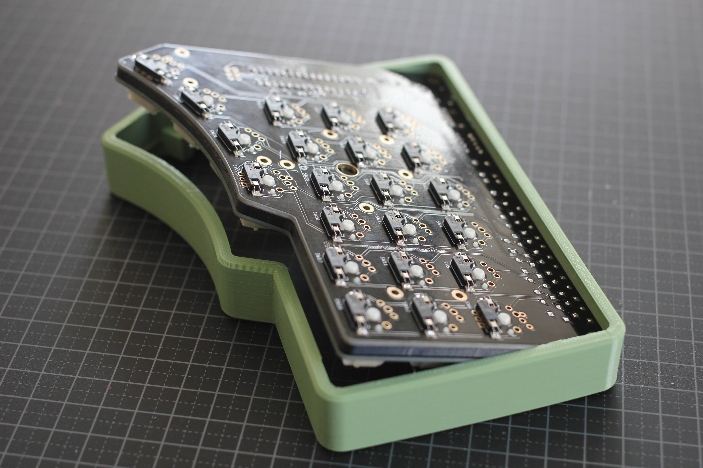

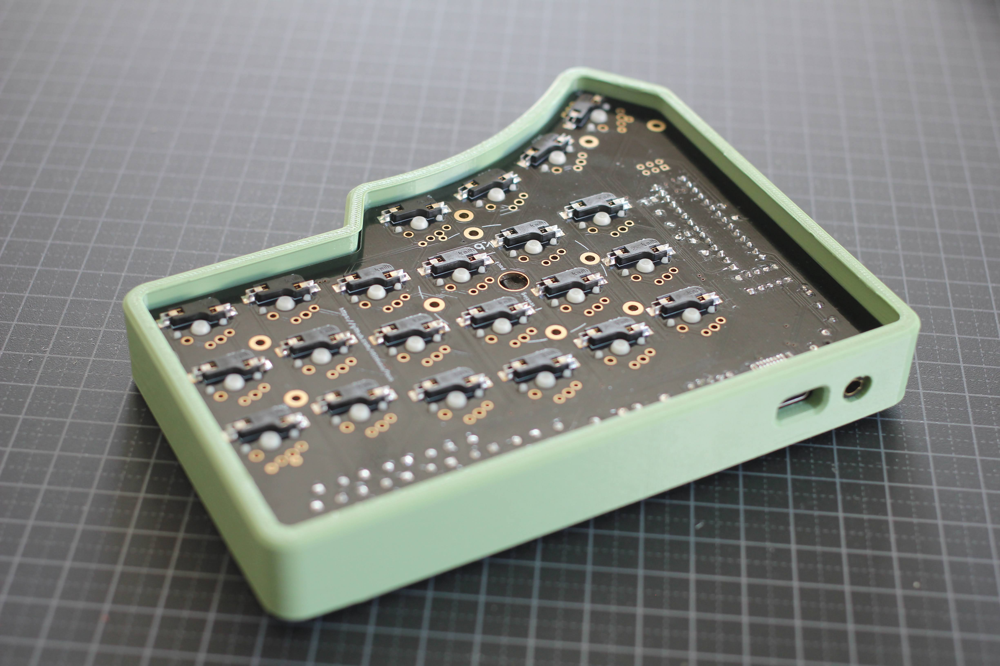

### Step 7

Now insert the base into the top of the case. This is similar to the previous step, start with the
back edge as shown below. Then carefully work around the edge of the case pressing the PCB
in place, ending by the thumb keys. You'll need to gently 'stretch' the top to get the base to fit.

The case should feel secure once it is snapped together.

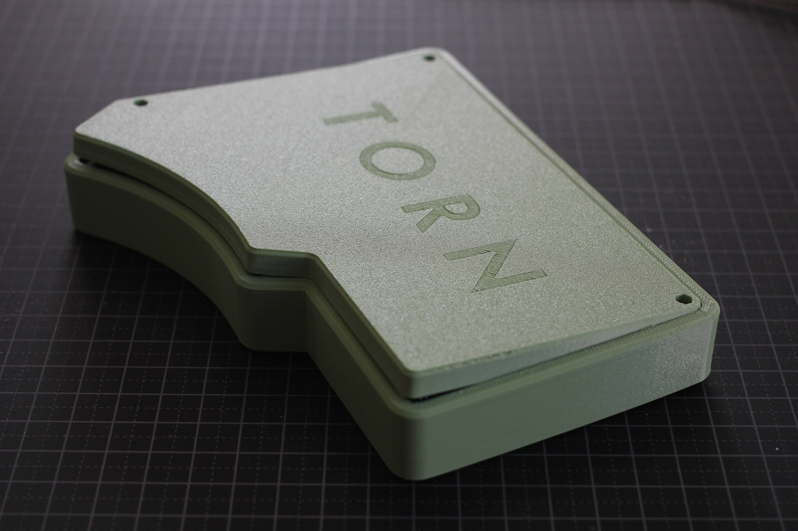

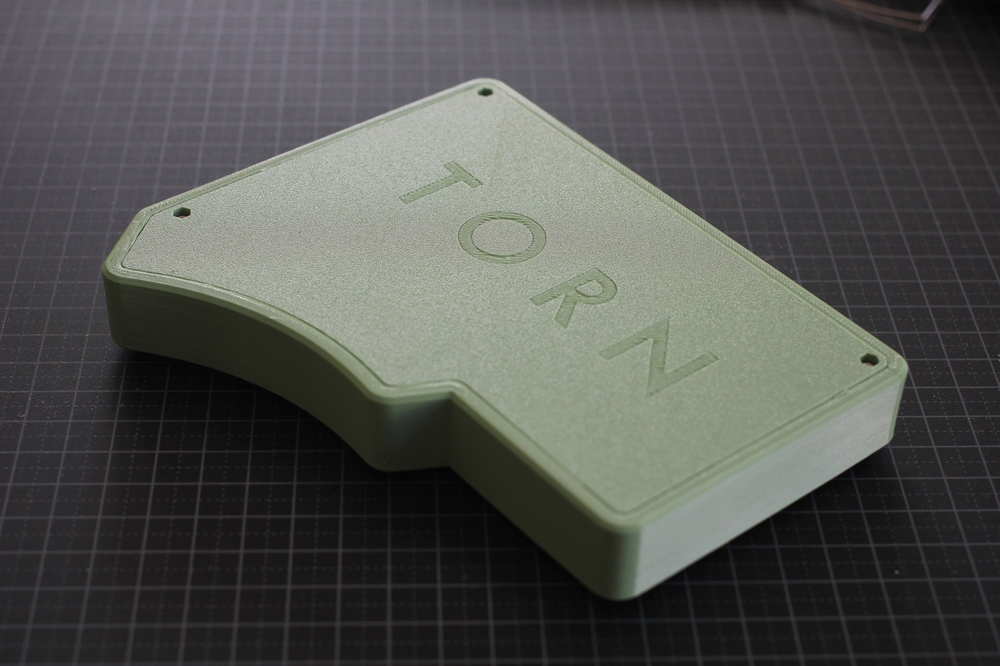

### Step 8

Add the acrylic cover. Secure with three m2 screws.

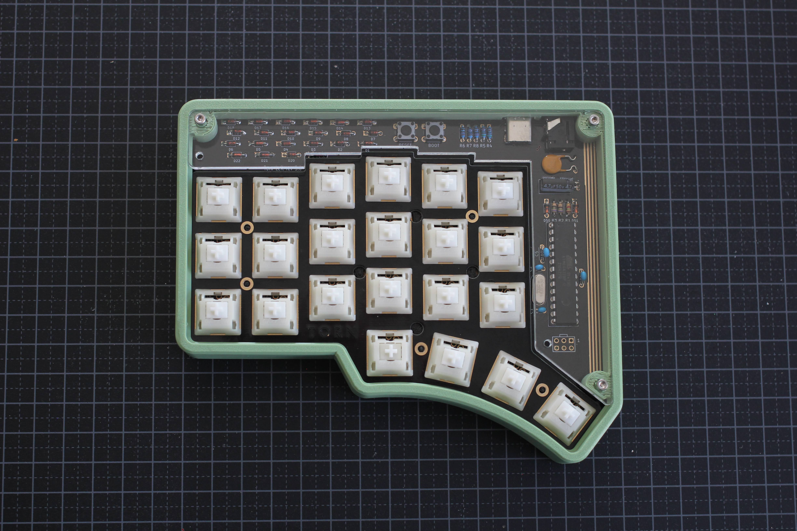

### Step 9

Finally add the keycaps.

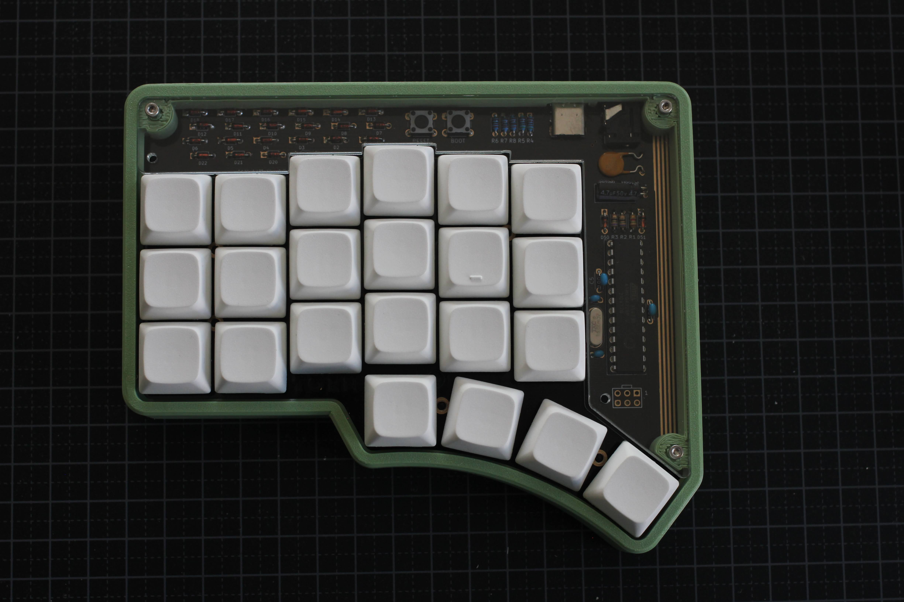
