# Torn Travel Case

This 3D printed travel case is designed for Kailh Choc switches, featuring a print in place hinge
with internal wiring.

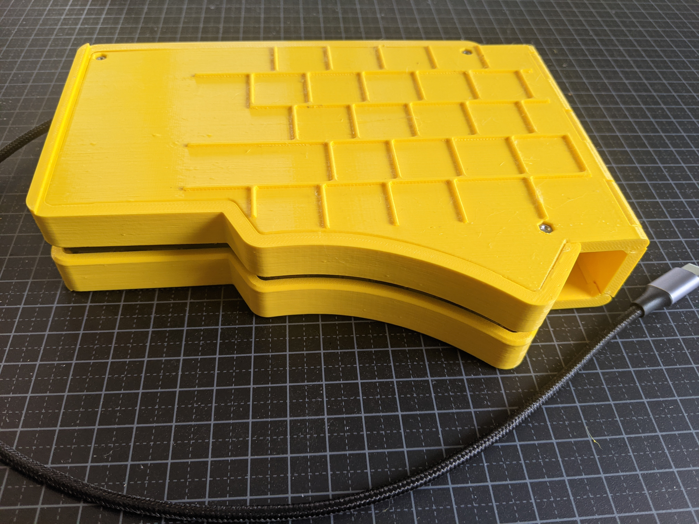

There are two versions of this case.  The version designed to be used with a 15 inch 2017 Macbook Pro
and features integrated cable routing and a guide to position the case over the Macbook keyboard.

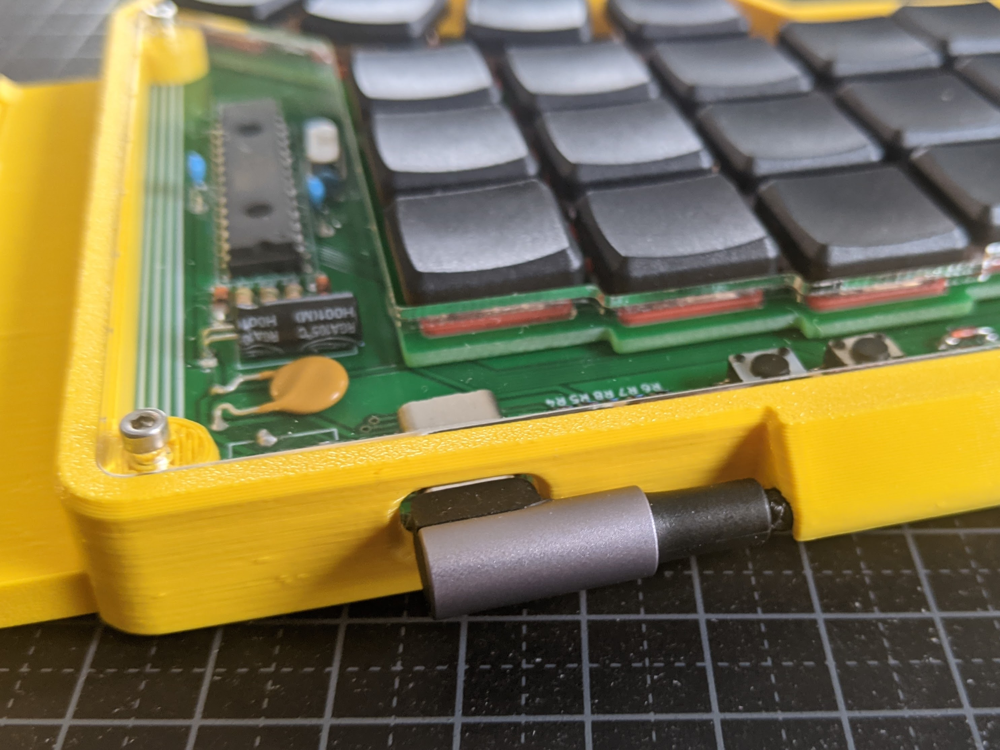

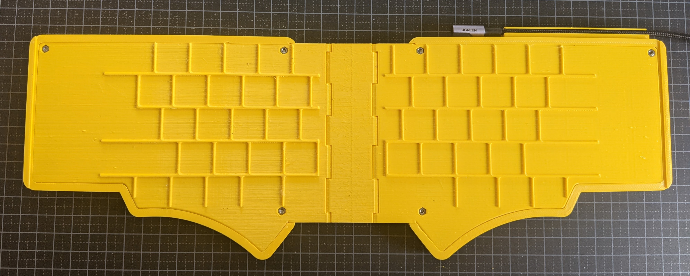

The basic version is a folding travel case without the cable routing and key guides.

## Parts

To complete the Travel Case you need:

- Assembled Torn PCBs with Kailh Choc switches (but see notes below)
- 3d printed parts using the STLs below
- 4 wires
- 2 x acrylic covers
- 6 x m2 nuts
- 6 x m2 x 12mm cheese head screws
- UGREEN USB C to USB C Cable _Right Angle 90 Degree_ (optional, for Macbook case)

## STLs

This case has been tested with a Prusa i3 Mk3S+ using PTEG. The parts are designed to be a tight fit
so tolerances may vary with other printers or plastics. The parts are available in STL or 3MF. You
can use the 3MF files in [PrusaSlicer](https://www.prusa3d.com/prusaslicer/) and they contain the
recommended print settings.

You need to 3d print the following parts for the basic travel case:

- Base [STL](./stl/Base%20basic.stl)
- Left Top [STL](./stl/Left%20basic.stl)
- Right Top [STL](./stl/Right%20basic.stl)

The 15 inch 2017 Macbook Pro version needs:

- Macbook Pro Base [STL](./stl/Base%20macbook.stl) [3MF](./stl/Base%20macbook.3mf)
- Macbook Pro Left Top [STL](./stl/Left%20macbook.stl) [3MF](./stl/Left%20macbook.3mf)
- Macbook Pro Right Top [STL](./stl/Right%20macbook.stl) [3MF](./stl/Right%20macbook.3mf)

_You do not need to change the orientation of the files on the print bed. Do not use supports for
the base_. The base prints vertically as shown in the picture below. To improve the print quality
make sure the seams are not near the hinged joints. After the base is printed you need to carefully
open the hinges. Do not use too much force or the hinges may break. Once free open and close the
hinges a few times until they move smoothly. 

The left and right tops need printing with supports. Carefully remove all the support material from
the case tops. Test that the acrylic cover fits flush with the edge of the case.

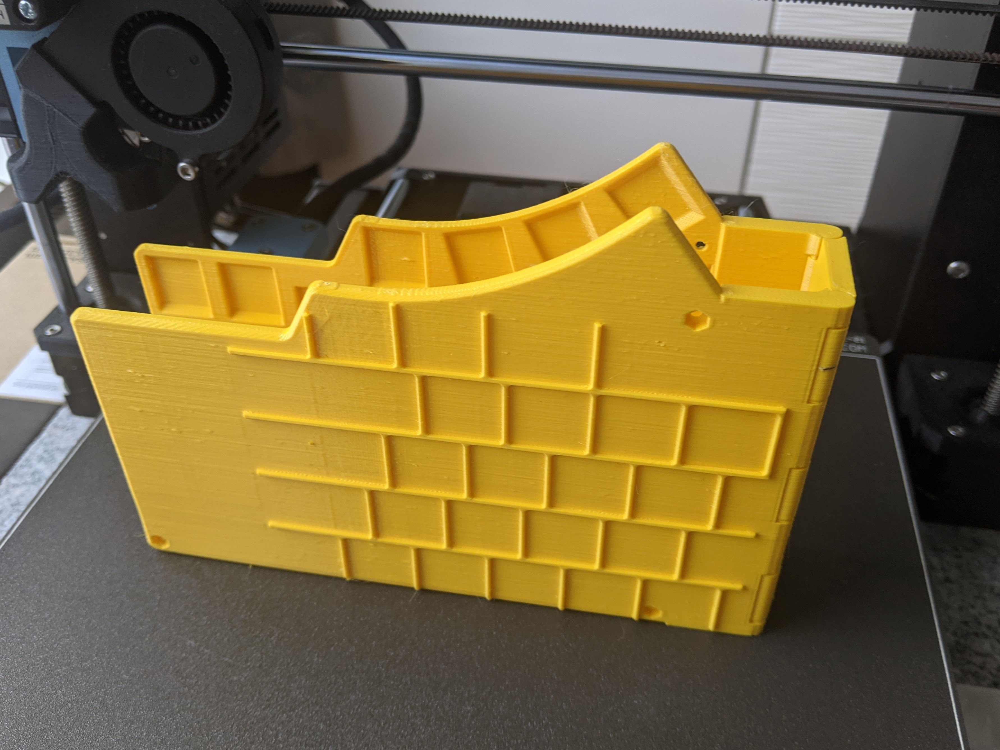

## Build guide

Before assembling the Choc Case you need to have assembled the [Torn PCBs](../../doc/pcb.md).

**Do not use the IC sockets (steps 13 and 22 in the main instructions). The ATMega328P and MCP23017 
must be directly soldered to the PCB. This is needed to reduce the height. You also don't need to
install the TRRS sockets (steps 12 and 21 in the main instructions) as the case includes internal
wiring.**

## Step 1

Place the pcb plate on the main pcb, and insert a few Choc switches. Make sure everything fits
correctly. Then add the remaining switches.

## Step 2

Check that the switches are all inserted correctly, then solder the switches. Complete Step 1 and
Step 2 for both the left and right sides before proceeding.

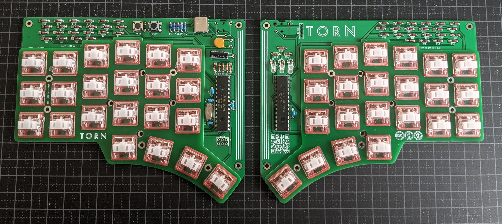

## Step 3

Insert six m2 nuts in the base of the case. Tighten an m2 screw to pull the nuts securely into the
base. Remove the screw afterwards.

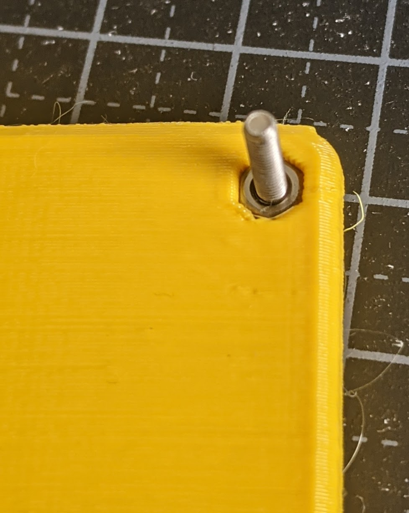

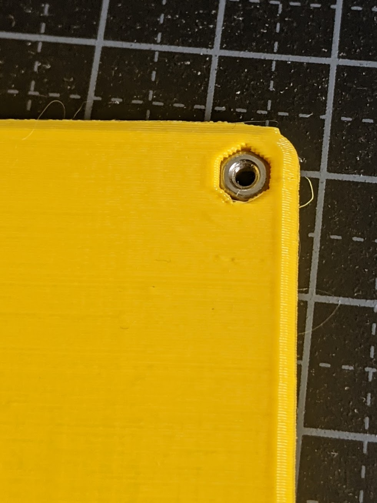

## Step 4

Solder four wires to the TRRS pins on the left pcb. The wires should be on the underside of the
pcb. There is little clearance in the case for the wires, so it is important to arrange them as
shown in the pciture below.

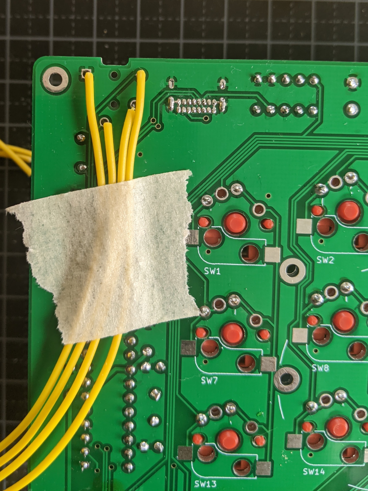

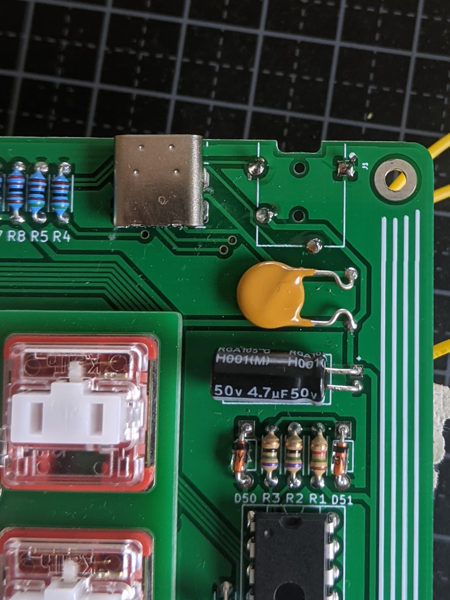

## Step 5

Insert the completed left pcb in the top left of the case.

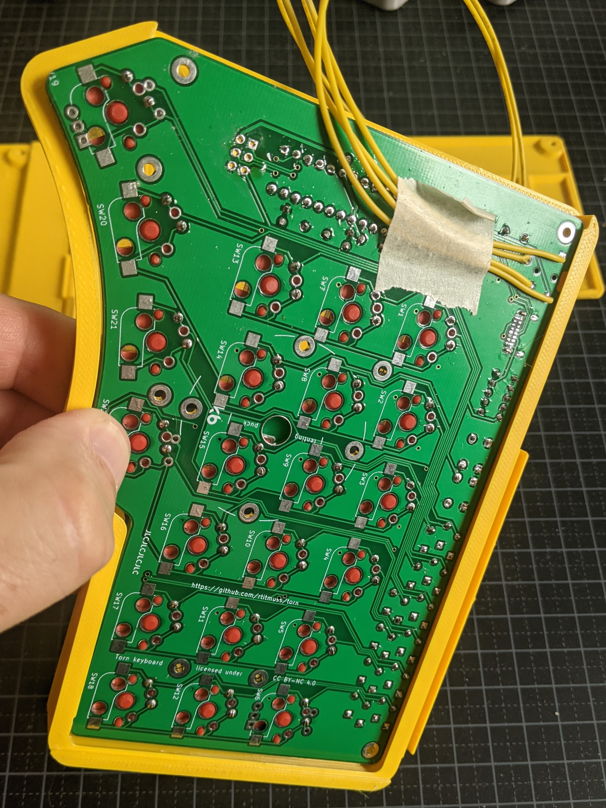

## Step 6

Carefully feed the wires through the hinge. Remember there is little clearance in the case underneath
the pcb so _the wires must not cross_. Use the pictures below for reference.

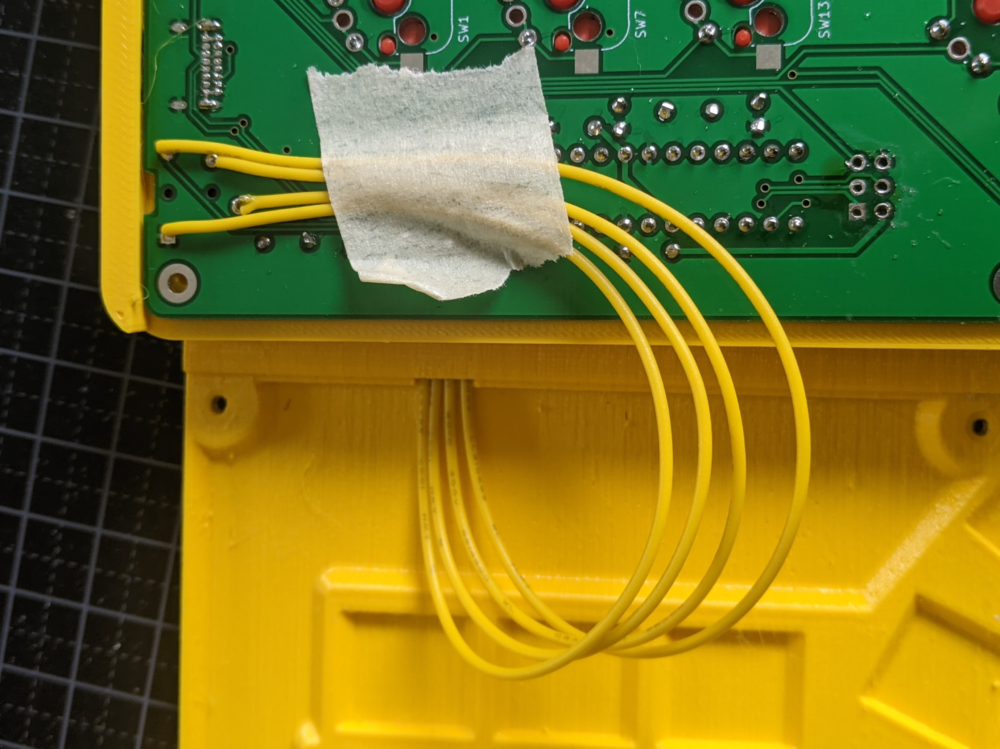

## Step 7

Assemble the left side the case. This is a snap fit, so work around the edges until the case is
completely closed. Check that the wires are not trapped, and that the hinge works smoothly.

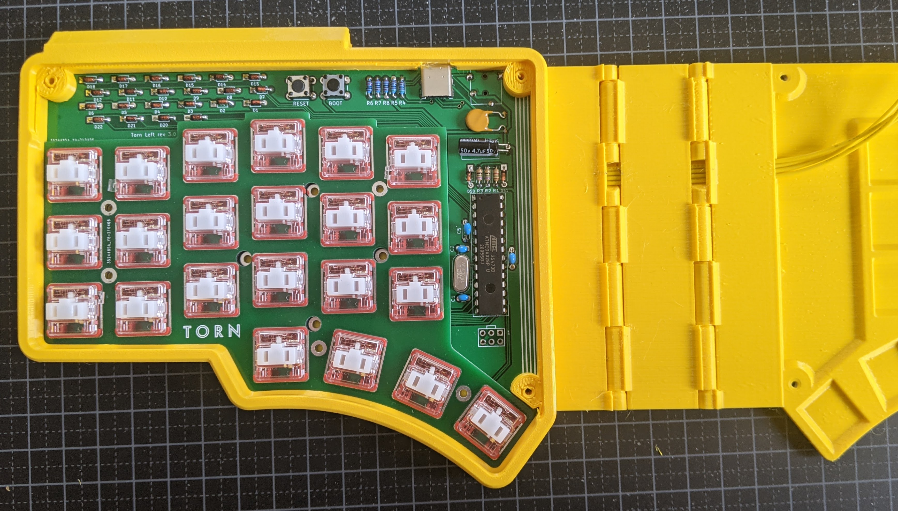

## Step 8

The wires need to be cut to the correct length. You can do this be bending the wires as shown below
and cutting inline with the top edge of the case. Strip the ends of the wires and tin them.

## Step 9

This step is fiddly, take your time. Solder the four wires to the right pcb as follows and shown in
the photo below. Take care with the wire routing, remember there is little clearance and the wires
must not cross.

- Top wire is GND, connect this to the TRRS port pin 1 (marked with a dot on the top silk screen).

- 2nd wire is I2C_SCL, connect this to the 2nd OLED pin (counting from the pcb edge).

- 3rd wire is VCC, connect this to the 3rd OLED pin.

- Bottom wire is I2C_SCK, connect this to the 1st OLED pin.

You can solder the wires from the top of the PCB.

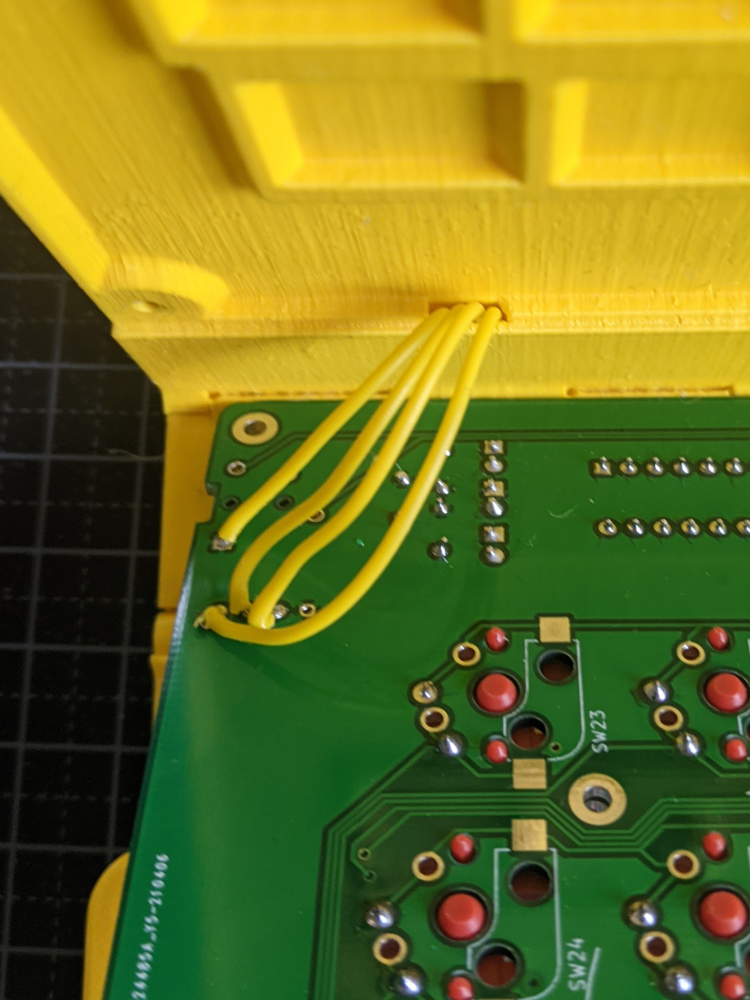

## Step 10

Insert the right pcb in the top right of the case and assemble the case. This is a snap fit, so work
around the edges until the case is completely closed. Check that the wires are not trapped, and that
the hinge works smoothly.

## Step 11

Double check the TRRS wiring. You can do this with a multimeter set to test the continuity.

| ATmega328P | MCP23017 | Signal  |
| ---------- | -------- | ------  |
| Pin 7      | Pin 9    | VCC     |
| Pin 8      | Pin 10   | GND     |
| Pin 28     | Pin 12   | I2C_SCL |
| Pin 27     | Pin 13   | I2C_SDA |

You can refer to the [troubleshooting guide](../../doc/troubleshoot.md) to see the pinouts.

## Step 12

Add the acrylic covers and secure with six 12mm m2 screws. Fit the keycaps and USB cable. Enjoy!

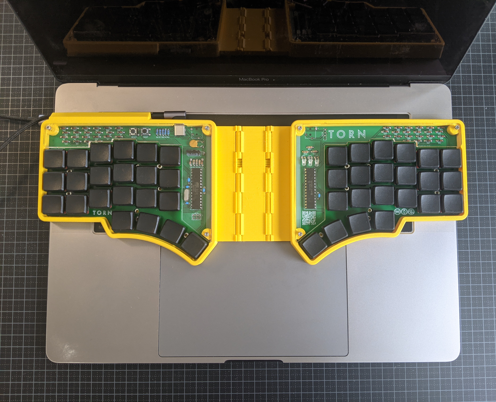
